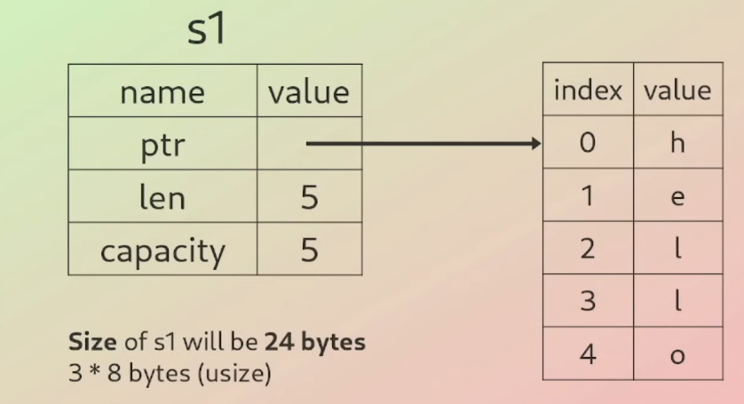
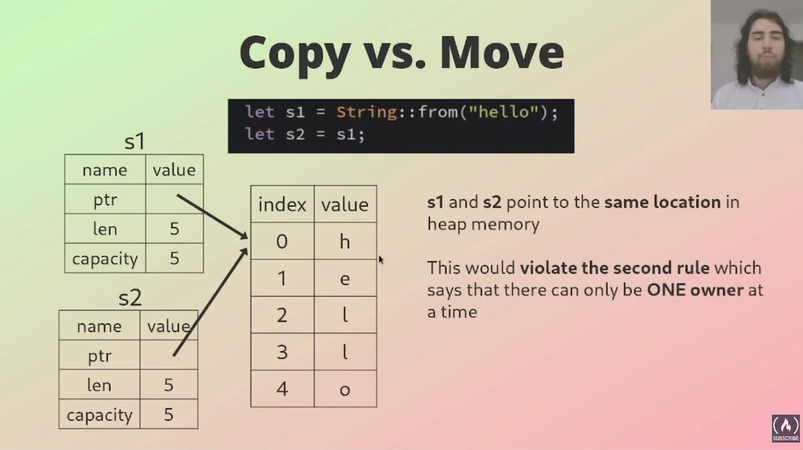
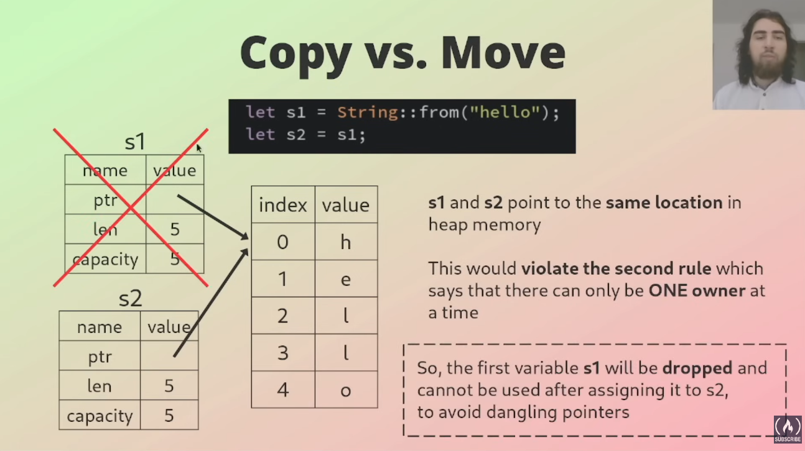
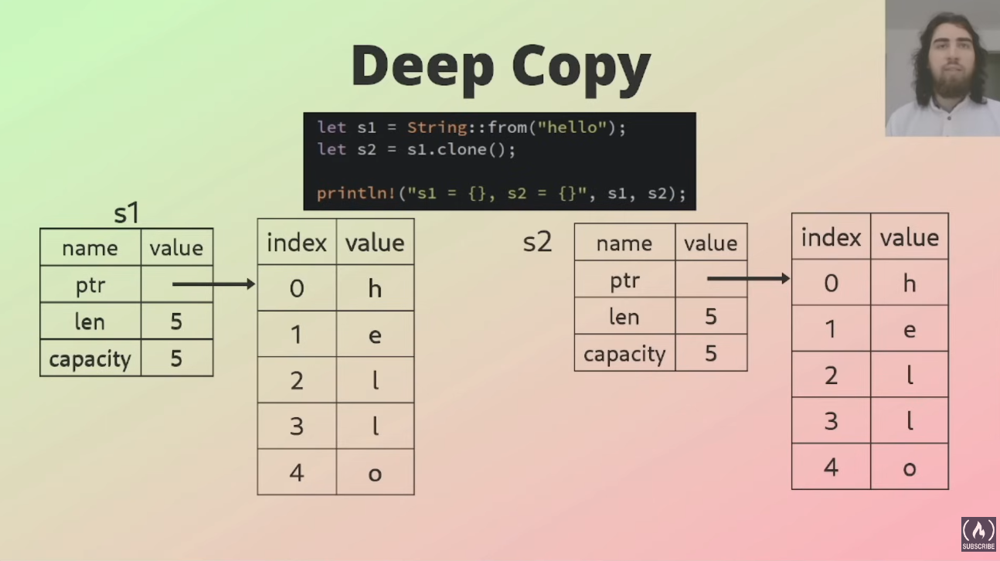
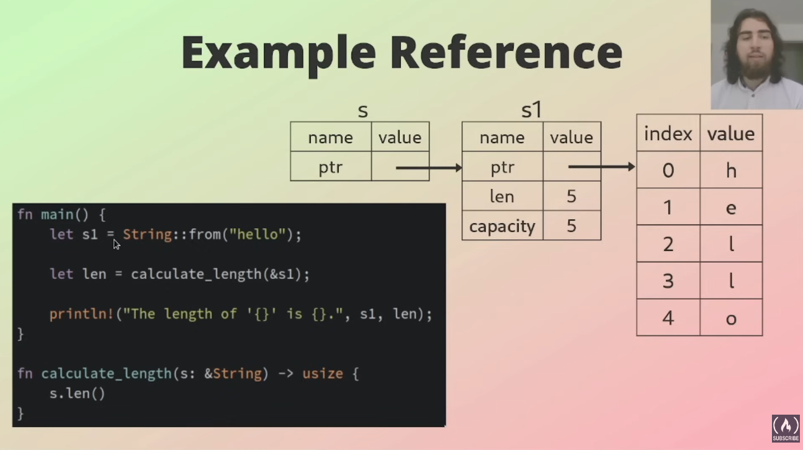

# Ownership

- Rust's ownership system is unique and sets it apart from other programming languages.
- Set of rules that govern memory management.
- Rules are enforced at compile time.
- If any of the rules are violated, the program won't compile

### 3 Rules of Ownership

1. Each value in Rust has an owner.
2. There can only be one owner at a time.
3. When the owner goes out of scope, the value will be dropped.

**Owner**
The owner of the value is the variable or data structure that holds it and is responsible for allocating and freeing the memory used to store the data.

## Scope

- Range within a program for which an item is valid.

- **Global Scope**: Accessible throughout the entire program.
- **Local Scope**:
  - Accessible only within particular function or block of code
  - Not accessible outside of that function or block

## Memory

- Component in a computer to store data and instructions for the processor to execute
- Random Access Memory (RAM) is volatile, when power turned off all contents are lost.
- Two types of regions in RAM used by a program at runtime: Stack memory and Heap memory.

### Stack Memory

- Last in, First out (LIFO)
- All data stored on the stack must have a known, fixed size (like integers, floats, char, bool, etc...)
- Pushing to the stack is faster than allocating on the heap, because location for new data is always at the top of the stack.
- Types of unknown size will get allocated to the heap and a pointer to the value is pushed to the stack, because a pointer is fixed size (`usize`).

### Heap Memory

- Data of no known, fixed size belongs on the heap.
- Allocating data on the heap will return a pointer (an address to the location where data has been allocated/stored).
- Allocating on the heap is slower than pushing to stack.
- Accessing data on the heap is also slower, as it has to be accessed using a pointer which points to an address.

#### The String Type

- All types covered so far were fixed size
- String is mutable
- String size can change at runtime
- String stored on the stack with a pointer to the heap
- Value of String is stored on the heap

```rs
let s1 = String::form("hello");
```



- prt: Pointer to data stored on the heap
- len : Data size in bytes
- capacity: Total amount of memory received from the allocator

## Copy vs. Move

- Scalar values with fixed sizes (all types we covered at the beginning) will automatically get copied in the stack, copying here is cheap.
- Dynamically sized data won't get copied, but moved, copying would be too expensive.

**i.e.**

```rs
let x = 5;
let y = x;
```

- Here, the integer value of variable x will get copied into y and both variables are usable, because `i32` value has been copied
- **_`i32` is fixed size_**

```rs
let s1 = String::from("Hello");
let s2 = s1;
```

- As **s1** is just a pointer to data on the heap, Just the pointer will get copied into **s2**, **NOT** the whole data on the heap!




#### Deep Copy

```rs
let s1 = String::from("Hello");
let s2 = s1.clone();
```



## Preventing Issues

- Ownership prevents memory safety issues:

  - Dangling pointers
  - Double-free
    - Trying to free memory that has already been freed
  - Memory leaks
    - Not freeing memory should have been freed

## Borrowing

- Way of temporarily accessing data without taking ownership of it
- When borrowing, you're taking a reference (pointer) to the data, not the data itself
- Prevention of dangling pointers and data races
- Data can be borrowed **immutabily** and **mutably**
- There are certain rules when borrowing which we have to comply with, otherwise the program won't compile.

### Rules of References

1. At any given time, you can have either one mutable reference or any number of immutable references
2. References must always be valid



**Example of Mutable Reference**

```rs
fn main(){
    let mut s = String::from("Hello");
    change(&mut s);

    println!("{}", s);
}

fn change_string(str: &mut String){
    str.push_str(" ,World!");
}
```
