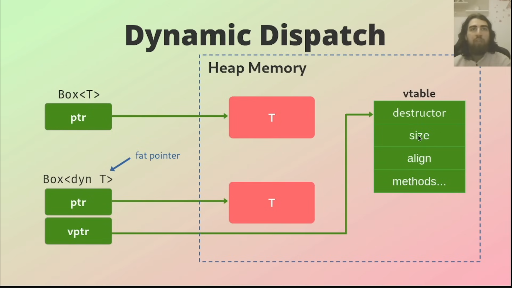

# Traits

- Set of methods that can be implemented for multiple types in order to provide common functionality and behavior between them
- Traits consists of methods _**signatures only**_, which then _**have to be implemented**_ by the target type
- Similar to "classes" in other languages, not quite the same though
- Defines shared behavior in an abstract way

## Derivable Traits

- Trait that can automatically implemented for a struct or an enum by the Rust compiler
- Called "derivable" because they can be derived automatically
- Most common derivable traits:

  - **Debug**: Allowing to output content via `{:?}`
  - **Clone**: Enables type to be duplicated with `clone()` method
  - **Copy**: Enables type to be copied implicitly, without requiring explicit `clone()` method
  - **PartialEq**: Enables comparison

## Traits as Parameters

- Traits can be used as parameters for functions

```rs
pub fn notify(item: &impl Summary){
    println!("Breaking news!! {}", item.summarize());
}
```

- The function notify() takes as argument any type that has implemented the Summary trait

## Traits Bounds

```rs
pub fn notify<T: Summary>(item: &T){
    println!("Breaking news!! {}", item.summarize());
}
```

- Similar to example using `impl Summary` but more **verbose**. Traits bounds are declared like generics, after name of the function. Use **trait bounds** if you have lots of parameters to avoid this:

```rs
pub fn notify(item1: &impl Summary, item2: &impl Summary){}
              /* ↓ */
pub fn notify<T: Summary>(item1: &T, item2: &T){}
```

## Where Clauses

```rs
fn some_function<T:Display + Clone, U: Clone + Debug>(t: &T, u: &U) -> i32 {}
```

- If you have a function that makes **heavy use** of trait bounds, we can use a `where clause` to make the code cleaner

```rs
fn some_function<T, U>(t: &T, u: &U) -> i32 where T:Display + Clone,
U: Clone + Debug, {}
```

## Return Types that Implement Traits

```rs
trait Animal {}

struct Dog;
struct Cat;

impl Animal for Dog{}
impl Animal for Cat{}

fn return_dog() -> impl Animal {
    Dog()
}

fn return_cat() -> impl Animal {
    Cat()
}

fn main() {
    return_dog();
    return_cat();
}

```

### **Default Implementation**

```rs
trait Greeting {
    // Default implementation
    fn say_hi(&self) -> String {
        String::from("hi")
    }

    // This method needs to be implemented by types that implement this trait
    fn say_something(&self) -> String;
}

struct Student {}
struct Teacher {}

// Implementing the Greeting trait for Student
impl Greeting for Student {
    fn say_something(&self) -> String {
        String::from("I am a student.")
    }
}

// Implementing the Greeting trait for Teacher
impl Greeting for Teacher {
    fn say_something(&self) -> String {
        String::from("I am a teacher.")
    }
}

fn main() {
    let s = Student {};
    let t = Teacher {};

    println!("For Student: {}", s.say_hi());
    println!("For Student: {}", s.say_something());
    println!("For Teacher: {}", t.say_hi());
    println!("For Teacher: {}", t.say_something());
}
```

## Derive

The compiler is capable of providing basic implementations for some traits via the `#[derive]` attribute, For more info [visit](https://doc.rust-lang.org/rust-by-example/trait/derive.html)

## Operator

In Rust, many of the operators can be overloaded via traits. That is, some operators can be used to accomplish different tasks based on their input arguments. This is possible because operators are syntactic sugar for method calls. For e.g. the `+` operators in `a + b` calls the add method (as in `a.add(b)`). This add method is part of the Add trait. Hence the `+` operator can be used by any implementor of the Add trait

## Trait Object

- Using `impl Trait` doesn't work when returning multiple types
- Different implementations of a trait probably use different amounts of memory, but usize of types must be known at compile time
- In this case, trait objects can be used
- A trait object is essentially a pointer to any type that implements the given trait, where the precise type can only be known at runtime.

## Static Dispatch

- Resolves methods calls at compile time
- Compile generated function code for each concrete type that implements trait
- Calls appropriate function based on concrete types
- Faster and more efficient than dynamic dispatch, but doesn't provide great flexibility

## Dynamic Trait Object

- Specific methods to be called is determined at runtime
- Works by creating a reference or smart pointer to a trait object using `&dyn` or `Box<dyn>`
- When trait object is created, compiler will build a **vtable** for that trait
- **vtable** is a table contains a pointer to the implementation of each method in the trait for the specific type of the object that the reference points to
- Compiler will do a lookup in a **vtable** to determine which method should be called for which type that implements the given trait
- This lookup will cause **overhead** but allows for **more flexible** code

```rs
trait Animal {}

struct Dog;
struct Cat;

impl Animal for Dog{}
impl Animal for Cat{}

fn return_animal(s: &str) -> &dyn Animal {
    match s {
        "dog" | "Dog" | "DOG" => &Dog{},
        "cat" | "Cat" | "CAT" => &Cat{},
        _ => panic!(),
    }
}

fn main(){
    let _animal1 = return_animal("cat");
    let _animal2 = return_animal("dog");
    println!("Success");
}
```

- Here we have a function which returns a type that implements the Animal trait. This could be Dog or Cat. As the trait object is behind a pointer, the size is known at compile time which is usize (size of a pointer)

This allows for more flexible code as the exact return type doesn't have to be known at compile time as long as the size is fixed


